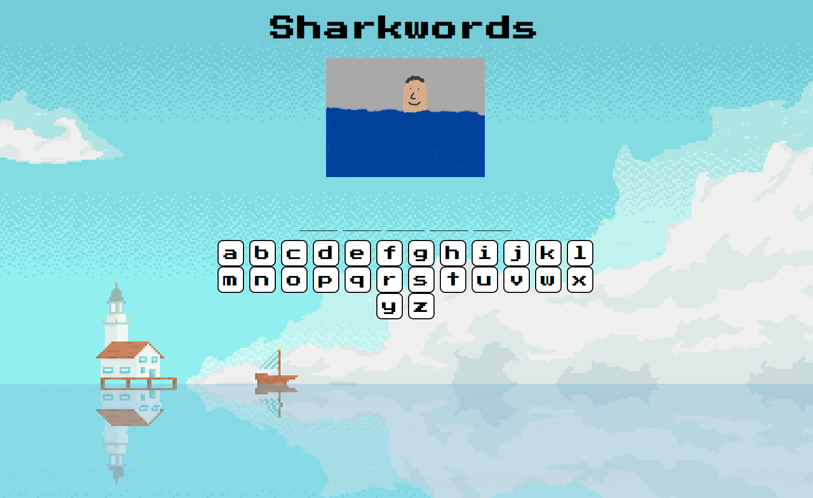
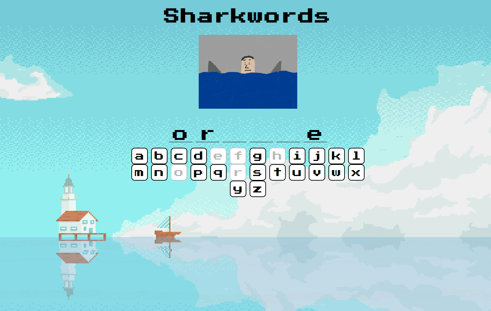
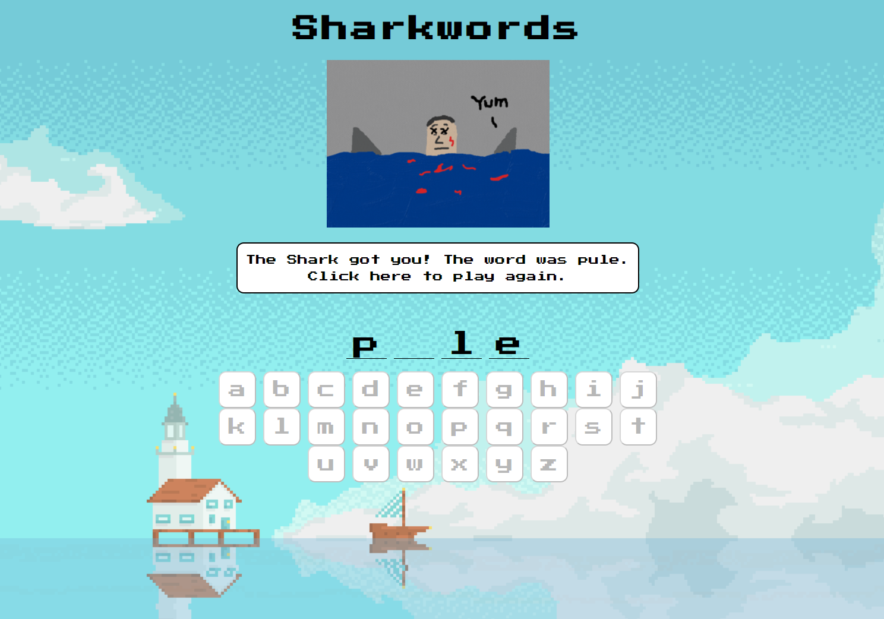

# 🦈 Sharkwords
Fun word guessing game - guess the word before the sharks attack!

## 🤖 Technologies Used
React, Javascript, HTML, CSS

## ✨ Demo





## 📖 Set Up
This project was bootstrapped with [Create React App](https://github.com/facebook/create-react-app).
To run this project, first clone or fork this repo:
```
git clone https://github.com/kat-jiang/react-sharkwords-game.git
```
To configure the app, go into the directory and run:
```
npm install
```
Run the app:
```
npm start
```
You can now navigate to '[http://localhost:3000](http://localhost:3000) to access the game in your browser!
